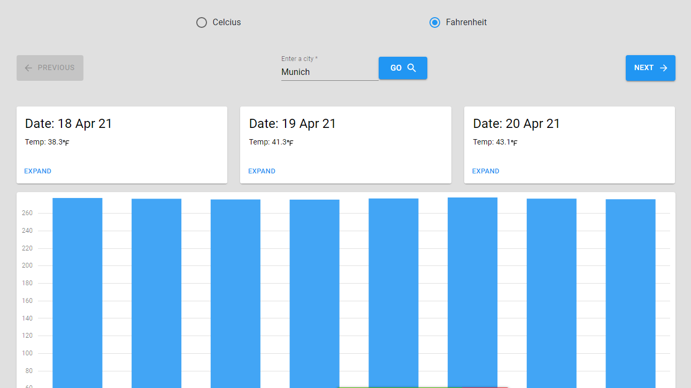

# Weather-App

An App where you can view the temperature, description of the weather condition of any city.

# Weather Page

## About this project

- This Weather app is an app to check the weather outside so we do not actually have to go outside to see what it's like. It contains the Loading screen and weather info screen. A bar chart is available to also view the different 8 weather temperature in a day at a glance.

## Built With
- ReactJs
- React Hooks
- Redux
- Netlify (For deployment)
- Material-Ui
- ES6 JavaScript.

## Live Demo
- For the full working application click [here]()

## Installation
- To get a local copy up and running follow these simple example steps.

### Setup
-  Clone [this](https://github.com/taiwocoker/React-Weather-App) repo

### Follow:
1. cd into the project directory
2. run npm install
3. run npm start
4. Navigate to localhost:3000

## Author

👤 **Taiwo Coker**

- Github: [@githubhandle](https://github.com/taiwocoker)
- Twitter: [@twitterhandle](https://twitter.com/SelloCoker)
- Linkedin: [linkedin](https://linkedin.com/in/taiwo-coker)

## 🤝 Contributing

- Contributions, issues and feature requests are welcome!

- Feel free to check the [issues page](https://github.com/taiwocoker/React-Weather-App/issues)

## Show your support

- Give a ⭐️ if you like this project!
